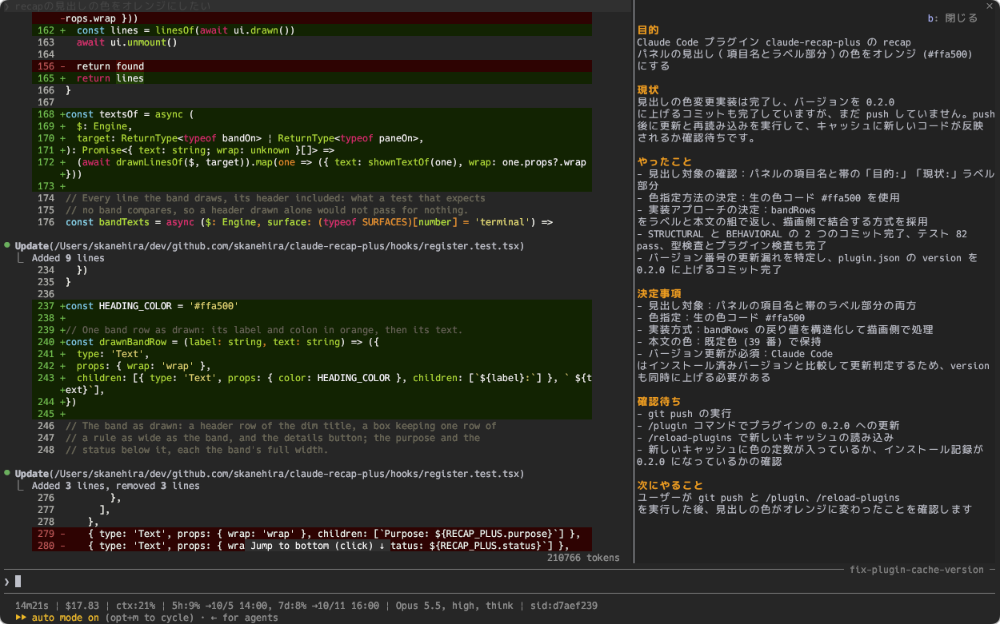

# claude-recap-plus

[English](README.md)

Claude Code の mod です。プロンプトのすぐ上に、そのセッションの概要を出します。
複数のセッションを並べて操作していても、切り替えた先のセッションの目的と進捗が、会話をさかのぼらずに分かります。



Claude Code の `language` を `"Japanese"` にしたときの表示です。

## 動作環境

- Claude Code 2.1.287 で動作確認済みです。mod の機能は early access で、API はリリースごとに変わることがあります。
- 設定や組織のポリシーで hooks が許可されている必要があります。

## インストール

Claude Code で次のコマンドを実行します。

```text
/plugin marketplace add skanehira/claude-recap-plus
/plugin install recap-plus@claude-recap-plus
/reload-plugins
```

`/recap` と入力し、`/recap-plus` が候補に出れば読み込まれています。`claude plugin list` でも、`recap-plus@claude-recap-plus` が有効か確認できます。

旧名でインストールしている場合は、`/plugin` で旧プラグインを無効にしてからインストールしてください。保存した概要と使用量の累計は移行せず、新しいプラグインが会話から概要を再生成し、使用量を 0 から数えます。旧ファイルはそのまま残ります。

## 使い方

いつもどおり会話を始めると、プロンプトの上の帯に目的と現状を表示します。メインの会話のターンが終わるたびに概要を更新します。作業中は前回の概要を表示し、「現状」に「(作業中)」を付けます。最初の概要は、最初のターンが終わった後に表示します。

`/recap-plus` または帯の「詳細」ボタンで、概要の全項目をパネルに表示できます。

| 項目         | 内容                                                     |
| ------------ | -------------------------------------------------------- |
| 目的         | セッションの目的と、対象のファイル・機能・プルリクエスト |
| 現状         | 今どこまで進んでいるか                                   |
| やったこと   | これまでにやったことのうち、最新 5 件                    |
| 決定事項     | Claude の質問への回答を含む、最新 5 件の決定             |
| 確認待ち     | Claude が回答や操作を待っていることのうち、最新 5 件     |
| 次にやること | Claude が次にすること                                    |

テキストは画面の幅に合わせて折り返します。パネルは Esc または「閉じる」ボタンで閉じられます。パネルにフォーカスがあるときは `b` でも閉じられます。パネル、ダイアログ、アンケートの表示中は帯を隠します。

概要はセッションごとに保存します。セッションを再開すると保存済みの概要を表示し、概要が無い場合や古い場合は生成します。`/clear` で新しい概要を始めます。

### キー操作

キー設定を足さなくても、`/recap-plus` でパネルを開けます。ctrl+x tab で帯にフォーカスしてから `b` を押しても開けます。帯をたたむ・戻す操作は ctrl+x ctrl+a です。

短いキーで操作するには、`~/.claude/keybindings.json` の `Chat` に次の設定を追加します。`/keybindings` でファイルを開けます。既に `Chat` がある場合は、その `bindings` に 2 行を追加してください。設定の変更は再起動なしで反映されます。

```json
{
  "bindings": [
    {
      "context": "Chat",
      "bindings": {
        "ctrl+x b": "app:cycleDiffBase",
        "ctrl+x i": "abovePrompt:toggle"
      }
    }
  ]
}
```

| キー     | 動作                               |
| -------- | ---------------------------------- |
| ctrl+x b | 概要パネルを開く。表示中なら閉じる |
| ctrl+x i | 帯をたたむ。もう一度押すと戻る     |

ctrl+x b が効くのは、帯か概要パネルが見えている間だけです。帯をたたんでいるときは `/recap-plus` を使います。ダイアログが出ているときは、閉じてから操作します。差分パネル内の ctrl+x b は、通常どおり比較基準を切り替えます。

### 表示の言語

概要は Claude Code の `language` 設定に従います。たとえば `~/.claude/settings.json` に次の値を設定します。

```json
{
  "language": "Japanese"
}
```

`Japanese`、`日本語`、`ja`、`ja-JP` などの日本語の設定では、見出しと概要を日本語にします。それ以外の言語では、見出しは英語、概要は設定した言語になります。設定が無い場合は両方とも英語です。

設定を変えたら `/reload-plugins` を実行するか、セッションを起動し直します。既存の概要は、次のターンが終わった後に新しい言語へ変わります。

## コストと送信データ

概要の生成には、利用中の Claude Code と同じアカウント・プロバイダで Haiku を使います。メインの会話の各ターンが終わったときと、再開したセッションに新しい概要が必要なときに呼び出します。これらの呼び出しはトークンを消費し、セッションと同じ扱いで課金されます。

要約のために、前回の概要、依頼、Claude の最終回答、質問と回答、一部のツール操作を送ります。ツール操作には、コマンドの説明、ファイルパス、URL、検索語などが含まれます。概要を再生成するときは、過去の依頼や compact の要約も送ることがあります。ファイルを読む・検索するツールの操作記録は送りませんが、依頼や回答に引用された内容は送信対象に含まれます。

非対話の実行 (`claude -p`) では概要を生成しません。Haiku の呼び出しを止めるには、`/plugin` で無効にするか、次のコマンドを実行します。

```bash
claude plugin disable recap-plus@claude-recap-plus
```

Haiku を呼ばずに帯だけを出す設定はありません。[送信内容の詳細](docs/architecture.md#コストと送る内容)と[使用量の確認方法](docs/troubleshooting.md#使用量の確認)も参照できます。

## 更新

マーケットプレイス、プラグインの順に更新し、Claude Code を起動し直します。

```bash
claude plugin marketplace update claude-recap-plus
claude plugin update recap-plus@claude-recap-plus
```

## うまく動かないとき

- 帯が出ない場合は、`/plugin` で有効か確認し、`/reload-plugins` を実行して会話を始めます。たたんだ帯は ctrl+x ctrl+a、設定を追加していれば ctrl+x i で戻せます。
- ダイアログ、アンケート、概要パネルの表示中は帯を隠します。帯を使えるのはターミナル・デスクトップアプリの対話セッションです。VS Code 拡張、モバイル、`claude -p` では帯を表示しません。
- `/recap-plus` が使えない場合は、帯の「詳細」ボタンか、設定を追加した ctrl+x b を試します。
- 概要が古い場合は、次のターンが終わるまで待ちます。更新されない状態が続く場合や概要に誤りがある場合は、[詳細な診断と概要のリセット](docs/troubleshooting.md)を参照してください。

## アンインストール

```bash
claude plugin uninstall recap-plus@claude-recap-plus
claude plugin marketplace remove claude-recap-plus
```

キー設定を追加していた場合は、`~/.claude/keybindings.json` から 2 行を削除します。保存した概要と使用量の累計もすべて消す場合は、次のコマンドを実行します。

```bash
rm ~/.claude/plugins/store/recap-plus_*.json
```

## ドキュメント

- [内部動作](docs/architecture.md): 要約の生成、セッションの再開、保存形式、キー操作の仕組み。
- [開発手順](docs/development.md): ローカル環境の準備と検証コマンド。
- [詳細なトラブルシューティング](docs/troubleshooting.md): デバッグログ、使用量の確認、保存した概要のリセット。

## ライセンス

[MIT](LICENSE)
